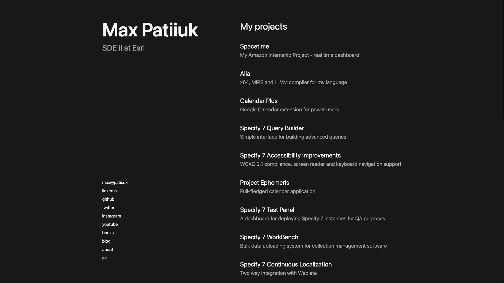

# max.patii.uk

Source code for [https://max.patii.uk](https://max.patii.uk) (portfolio of my
projects).

I am a huge fan of tacking minimalism to its extreme, so here is how my home
page looks like:



That's right, there are no cluttered submenus, no useless footers and no
unnecessary information.

Design inspirations:

- https://clementgrellier.fr/
- https://aakashns.com/
- https://www.apple.com/newsroom

## Development

```zsh
npm i       # install dependencies
npm run dev # start development server
```

This would start the development server at
[http://locahlost:3000](http://locahlost:3000).

## Production

```zsh
npm i         # install dependencies
npm run build # begin the build process
npm run start # start production server
```

This would start the production server at
[http://locahlost:3000](http://locahlost:3000).

Afterward, you can deploy this site at [https://vercel.com](https://vercel.com).

Alternatively, you can configure a reverse proxy (e.x Nginx) that would handle
the SSL certificate and forward the requests to port 80, which should be made
externally available.
