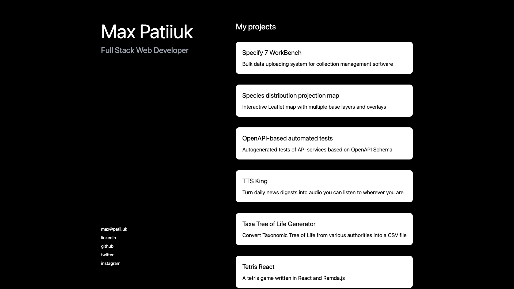

# max.patii.uk

This branch is a special version of my portfolio used for my
"Internship Exploration" class at the University of Kansas at 2022.

Enrollment in that class accompanied my summer internship at Amazon.

During the semester, I was writing reflection pieces and posts about
the internship. They are housed on this branch. 

To make them accessible in the UI, go to the `/internship` route, and
see the new menu items that appear on the left below my name.

---

Source code for [https://max.patii.uk](https://max.patii.uk).

I am a huge fan of tacking minimalism to its extreme, so here is how my home
page looks like:



That's right, there are no cluttered submenus, no useless footers and no
unnecessary information.

This site is primarily used as my portfolio, though it can also host random JS
projects (check out my [Tetris Game](https://max.patii.uk/projects/tetris)).

The design was inspired by
[Clement Grellier's portfolio](https://clementgrellier.fr/).

## Development

```zsh
npm i       # install dependencies
npm run dev # start development server
```

This would start the development server at
[http://locahlost:3000](http://locahlost:3000).

## Production

```zsh
npm i         # install dependencies
npm run build # begin the build process
npm run start # start production server
```

This would start the production server at
[http://locahlost:3000](http://locahlost:3000).

Afterward, you can deploy this site at [https://vercel.com](https://vercel.com).

Alternatively, you can configure a reverse proxy (e.x Nginx) that would handle
the SSL certificate and forward the requests to port 80, which should be made
externally available.
