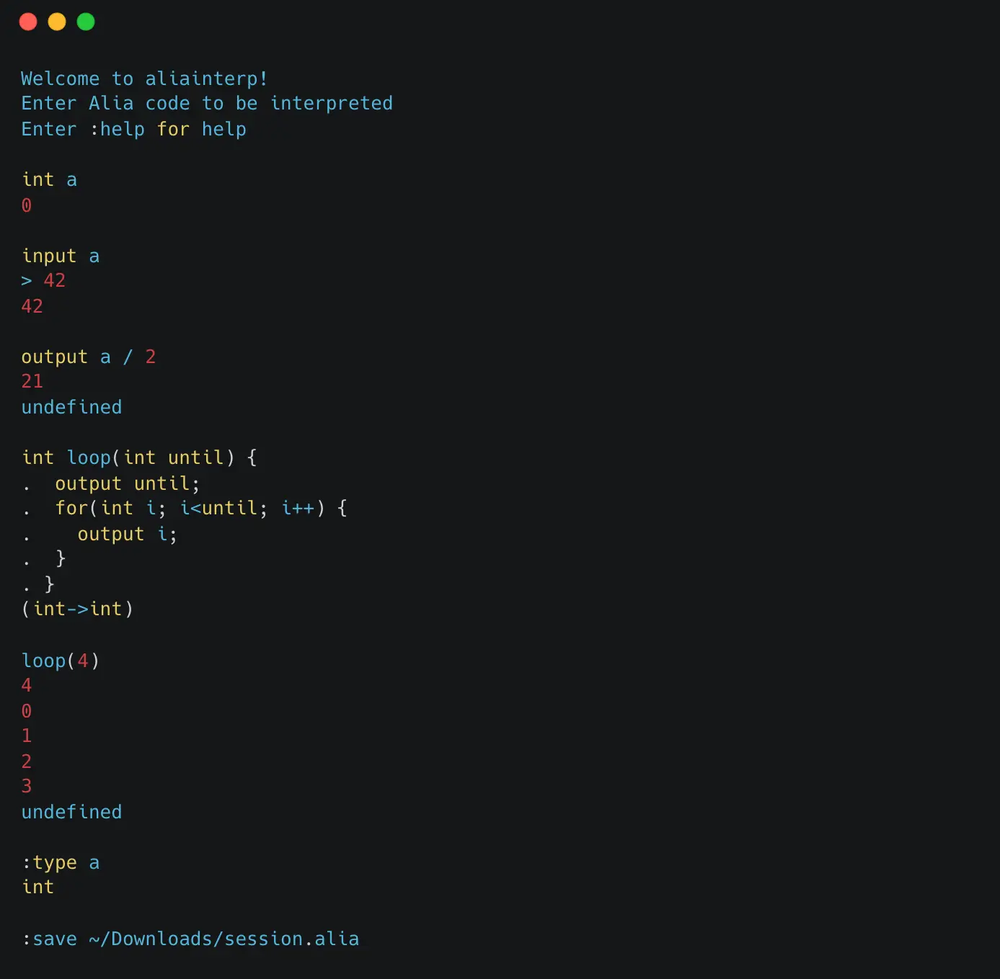

Alia is a programming language I created. Its syntax resembles C. It has a
compiler for x64 and MIPS assembly. Additionally, it can be compiled down to
LLVM bitcode, which in turn can be compiled for any architecture.

In addition, Alia includes an interpreter and a hefty test coverage.

For documentation of implementation and language specification, see
[Alia repository](https://github.com/maxpatiiuk/alia)

## Screenshot

## Technologies used

- TypeScript
- JavaScript
- Jest
- Graphviz
- GDB assembly debugger
- MARS (MIPS Assembler and Runtime Simulator)

## Things Learned

Besides the compiler construction related knowledge, I learned that GDB can also
be used as an assembly debugger.

In addition, working on the compiler for half a year showed me the value of code
quality and code refactoring as those impact developer experience and software
stability down the line.
