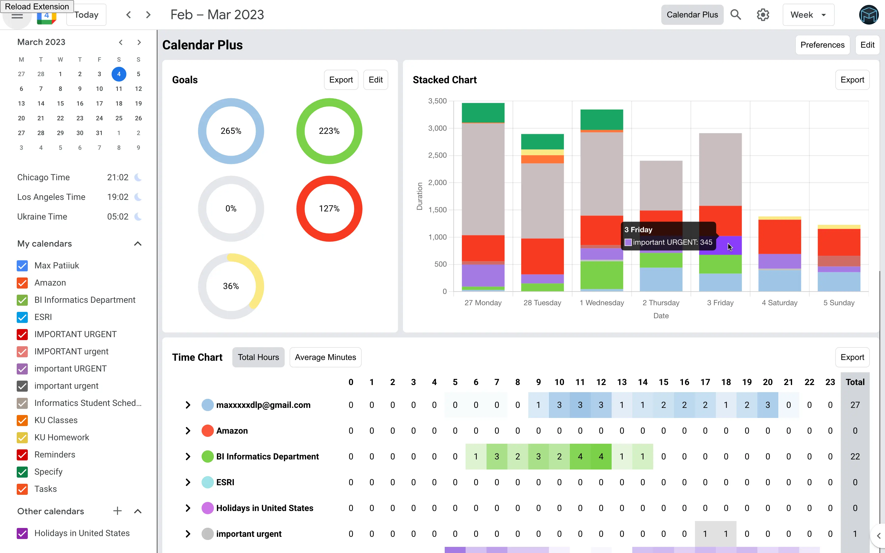
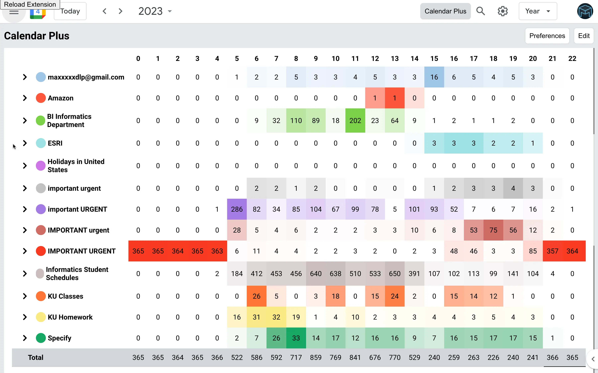
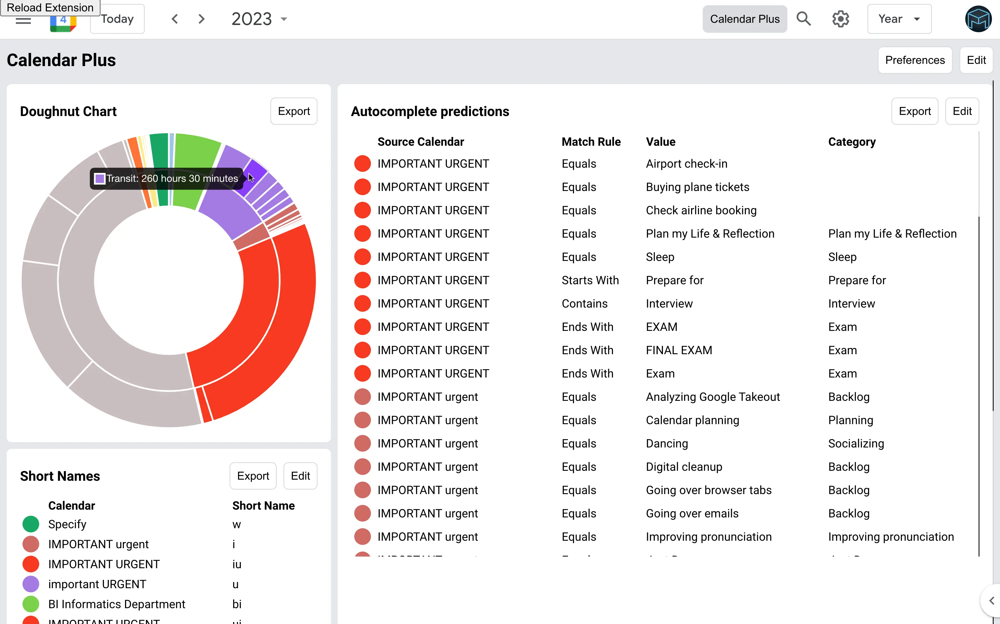
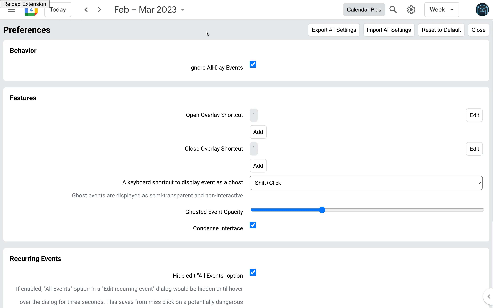
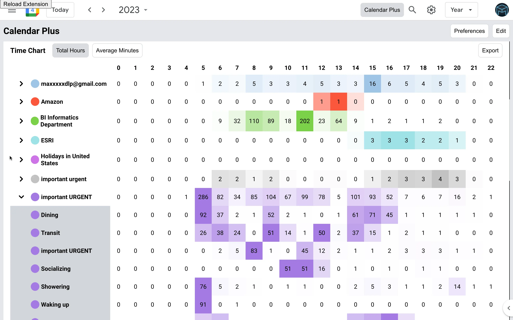
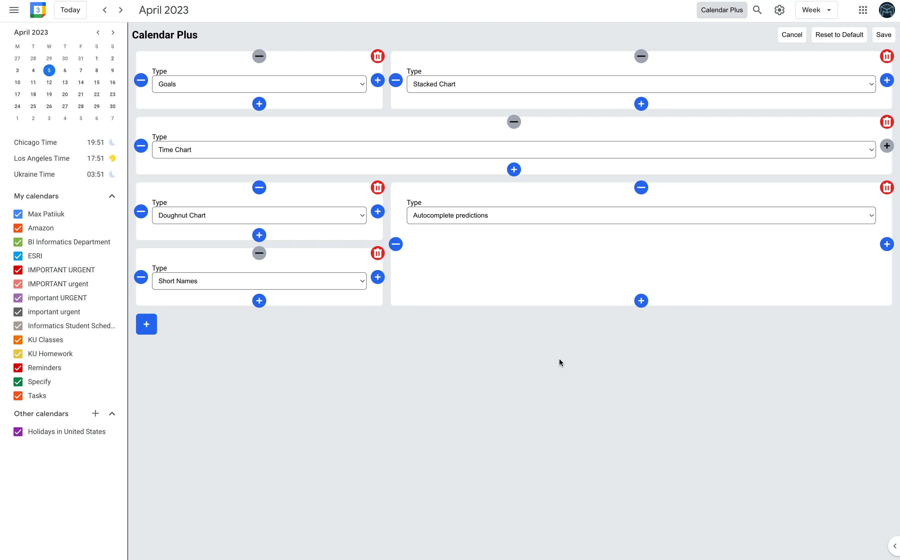

Calendar Plus is a Chrome extension for Google Calendar. It provides insights
into where your time goes, includes power user tools, data export and
customization.

[Try it out](https://chrome.google.com/webstore/detail/calendar-plus/kgbbebdcmdgkbopcffmpgkgcmcoomhmh)

Main features:

- Plot your week/month/year using Bar Chart, Pie Chart or a Time Chart
- Adds ability to ghost an event (make it semi transparent and non-interactive)
- Adds ability to condense the interface to have more space for events
- Adds autocomplete for event names when creating events
- Allows to automatically place events into correct calendars based on defined
  rules
- Supports exporting plotted data and exporting/importing plugin settings

<mp-youtube video="FZ_468t033A" caption="Video Demo"></mp-youtube>

## Screenshots

## Motivation

I am a power user of Google Calendar and have every day planned in 15 minute
increments. As a result, some shortcomings and missing features of Google
Calendar become especially painful. This extension promises to save me lots of
time, while providing insights into how much time I spent on different
activities.

See also my full-fledged calendar application:
[Project Ephemeris](/projects/project-ephemeris)

<mp-youtube video="Qku_Sskglzo" caption="Early prototype of the extension"></mp-youtube>

## Things learned

The extension needs read-only access to user's calendar, which is considered by
Google to be a sensitive API, thus applications looking to access that data need
to pass extra security. To that end, in addition to the Chrome Web Store review,
I needed to write a
[privacy policy](https://calendar-plus.patii.uk/docs/privacy/), comply with
"Sign in with Google" button branding requirements and pass a review by Google.
The extension was rejected several times due to incomplete compliance, but after
several tries it finally got approved.

Writing a privacy policy and complying with other requirements was an
interesting experience. Having done it once, I can do it much faster for my
second extension
[Goodreads Stats](https://github.com/maxpatiiuk/goodreads-stats).
