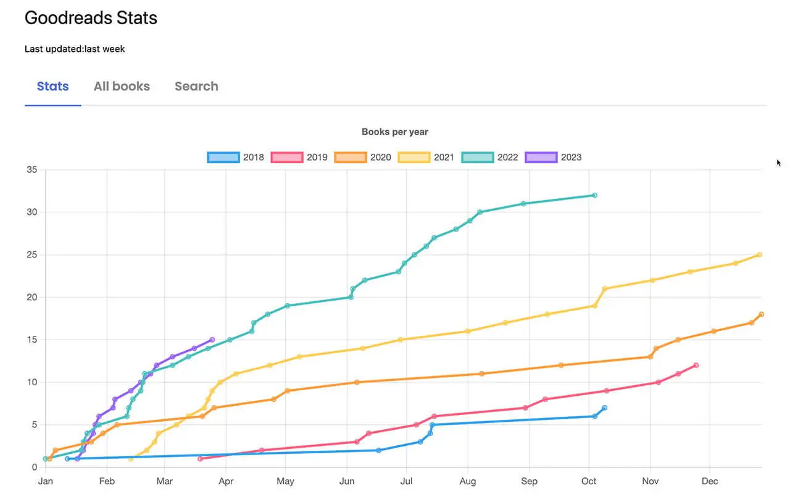
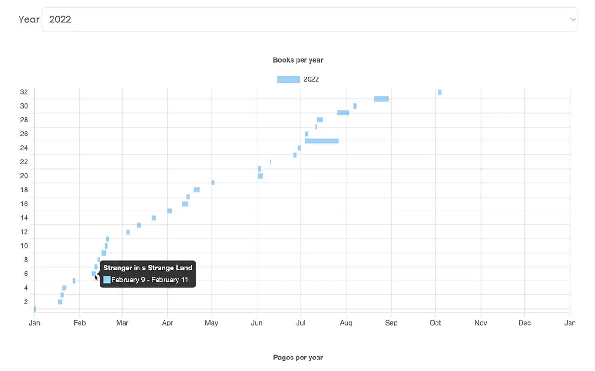
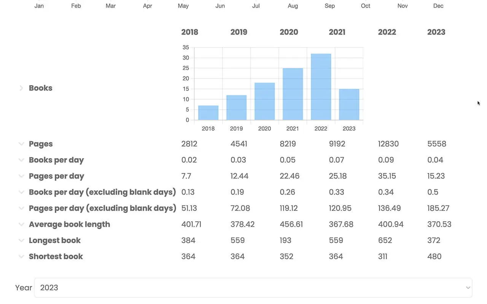
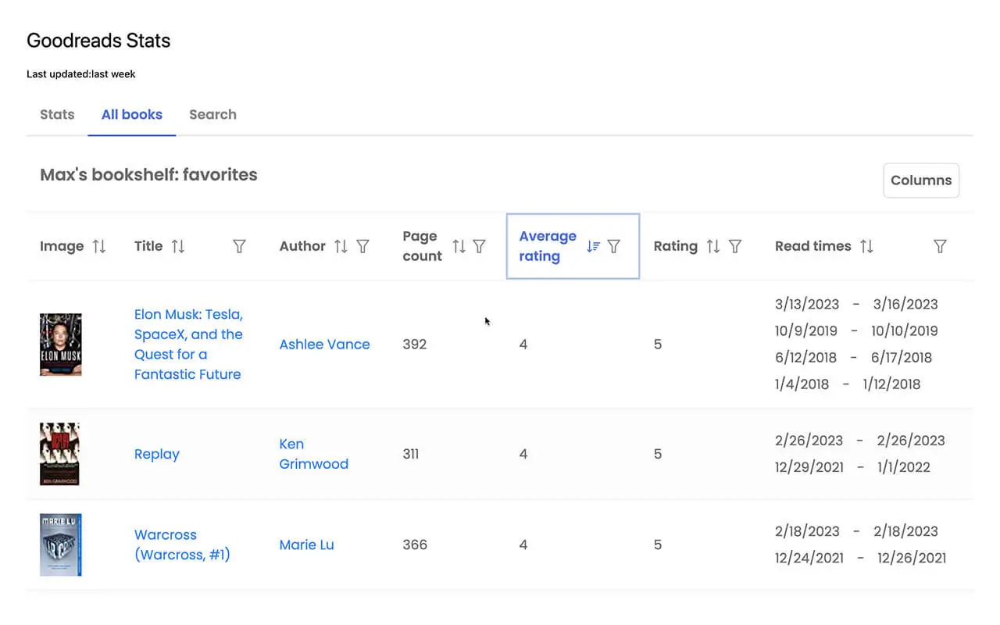
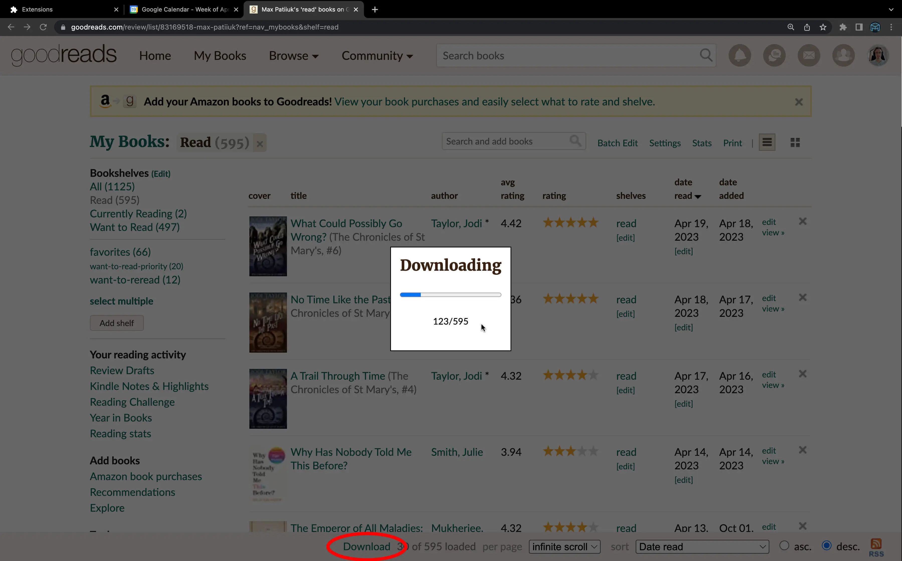

A browser extension for Goodreads that adds data export capability and displays
extensive analytics about your reading habits.

[Try it out](https://chrome.google.com/webstore/detail/goodreads-stats/hdpkeldenopncgodhpjdlpngmnaijpjf)

Main features:

- Export entire library
- Compare reading rates between years
- Show insights about your favorite books
- Search your entire book library

<mp-youtube video="f3w99Y45668" caption="Video Demo"></mp-youtube>

## Screenshots

## Things learned

This is one of the few projects where I worked against extreme time pressure,
thus had to make smart trade-offs. I went against my approach of using few
libraries, and took advantage of PrimeReact and PrimeIcon libraries for
displaying the table, pop ups and icons. Even thought those did a lot pf the
heavy lifting, customizing them and debugging issues, caused in part by poor
documentation, made the process take longer than expected.

In addition, I used Chart.js for all charts, which while much simpler to deal
with than d3.js thanks to a much more modern API and nice react wrappers, still
took some time to integrate with. The main issue was making charts be sized
automatically and be responsive to screen width change.

Take a look at [Calendar Plus](https://github.com/maxpatiiuk/calendar-plus) - a
Google Chrome extension for calendar power users. Having published the calendar
extension, and written a privacy policy for it, it was way easier to do it the
2nd time for the goodreads stats extension.
