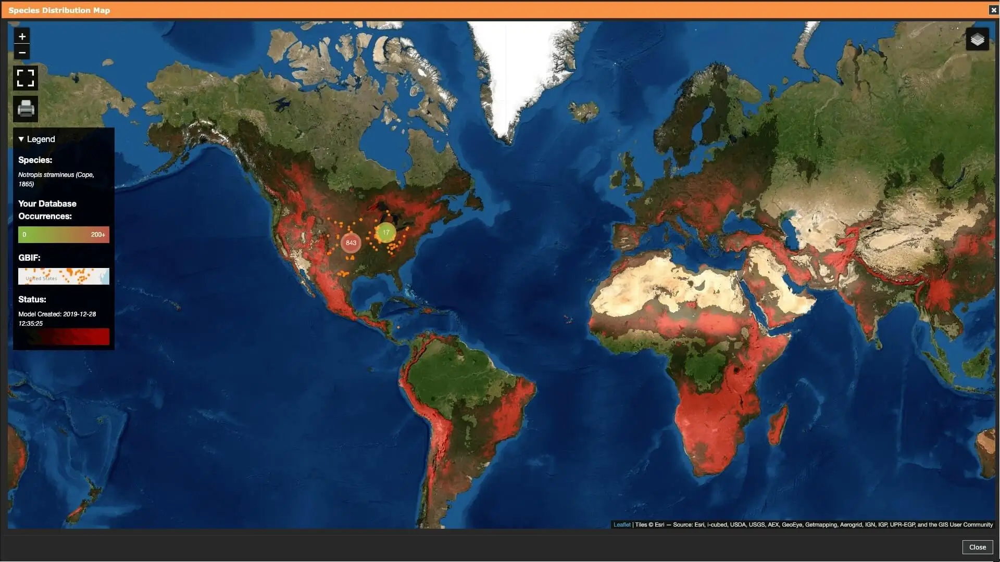
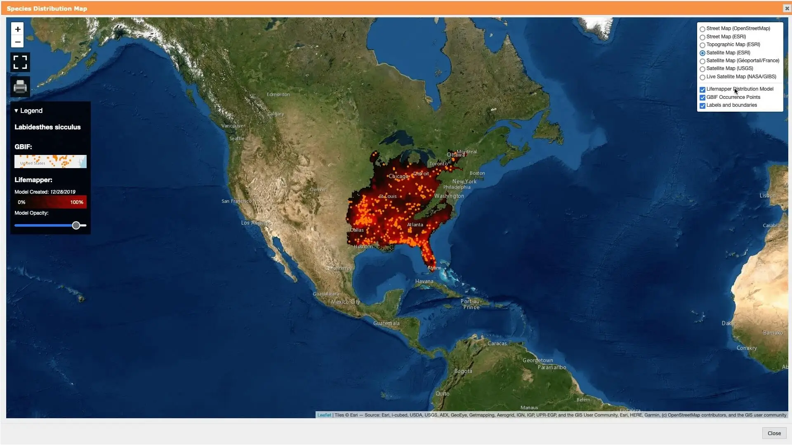
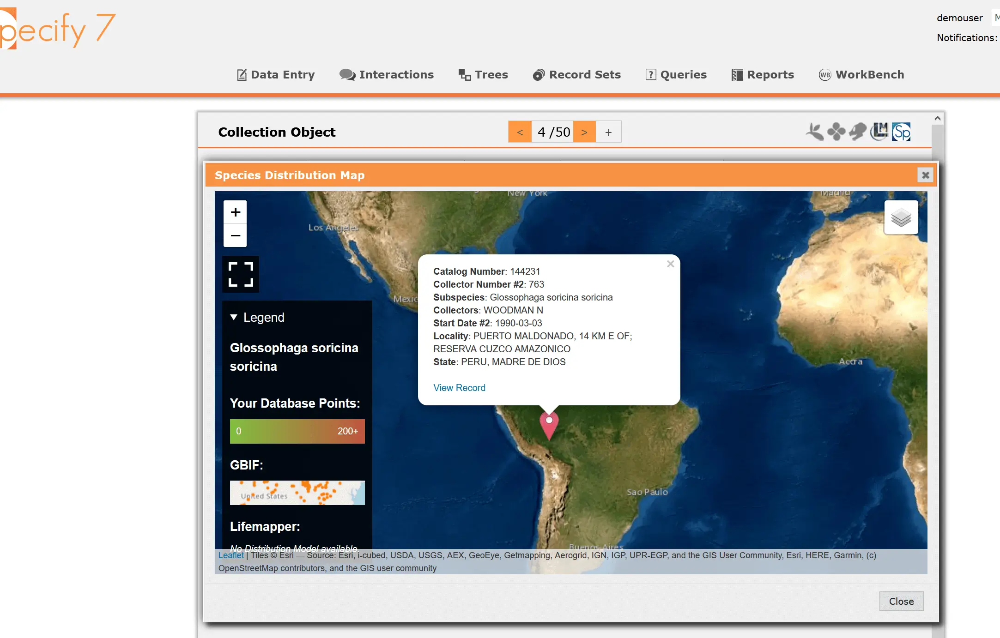
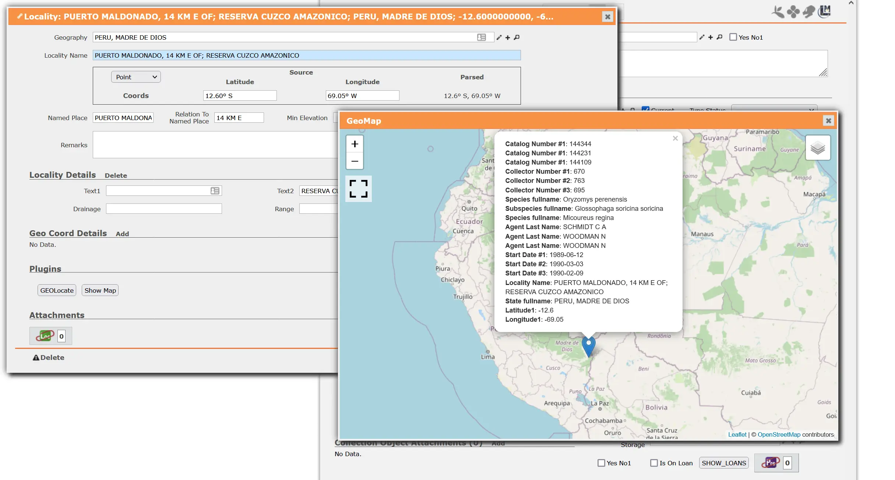
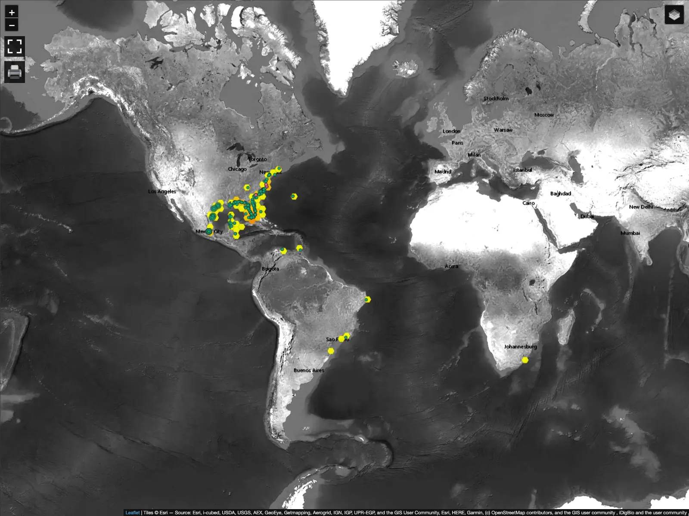
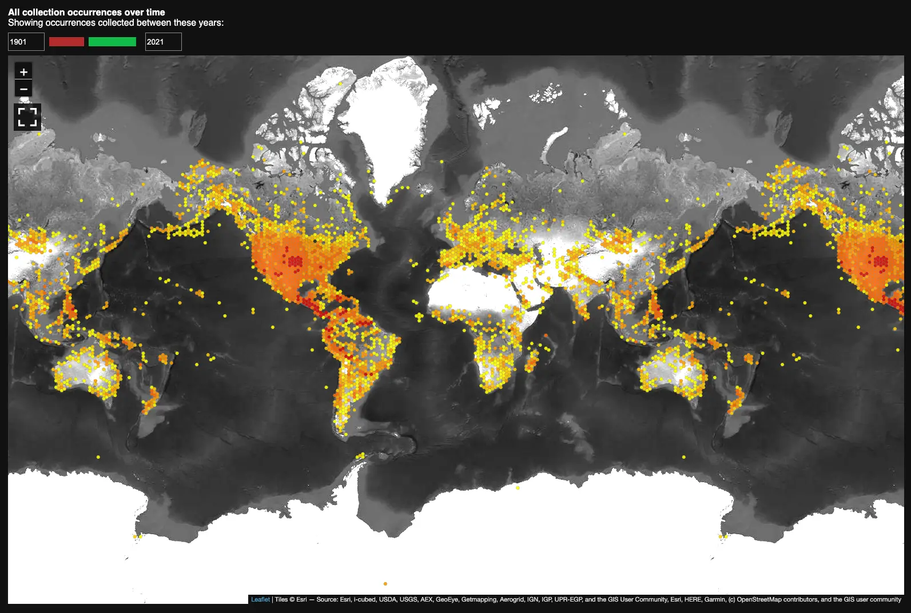

Species distribution map shows a projection of where particular species may be
commonly found. The map is generated by Lifemapper and is based on public
records submitted to GBIF.

I added an interactive Leaflet map that shows the projection map for the species
you are currently looking at in the collection management system,
Specify&nbsp;7.

Along with the distribution map and several base layers, specimen occurrence
points from the local database are also displayed to show how local data
compares to that of GBIF.

## Screenshots

## Technologies used

- JavaScript
- TypeScript
- React
- Docker
- Leaflet (library for interactive maps)
- Python (CherryPy)

<mp-youtube caption="Video overview" video="AQeWtZxQTns"></mp-youtube>
<mp-youtube caption="Video overview (in Russian)" video="fw_Ps4nF5FY" start="160"></mp-youtube>

## Things learned

The final product did not look anything like the original implementation. There
was a lot of discussion and code rewriting. While this allowed us to slowly
converge on a best solution, the process wasn't as efficient as it could have
been. If I had to do it again today, I would make sure to make heavy use of
Figma to quickly prototype the interface and to tell a story of the user
experience.

Figma is great for creating prototypes that, unlike coded implementation, can be
adjusted easily until a satisfactory result is achieved.
