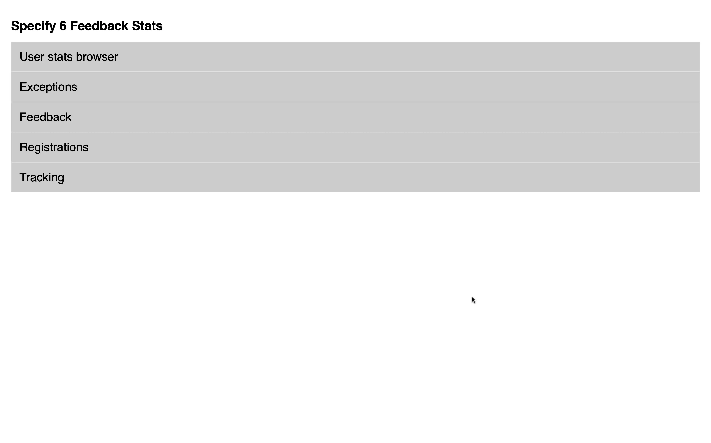
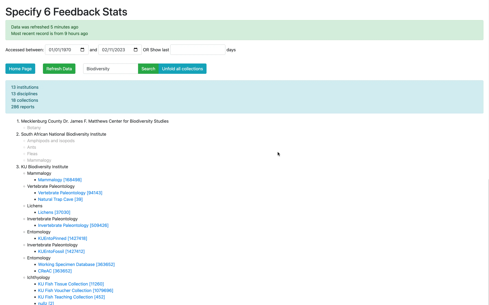
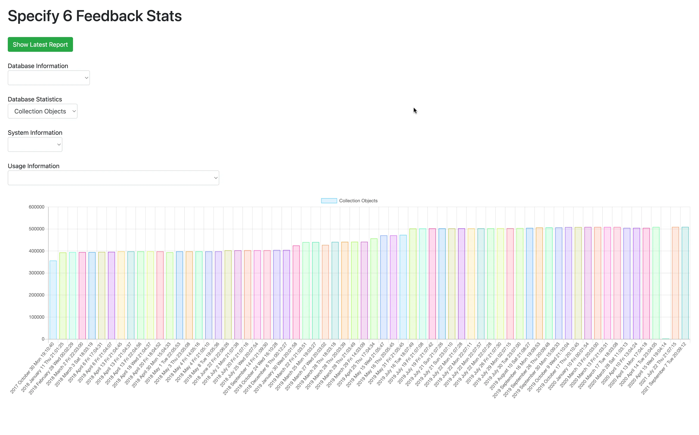
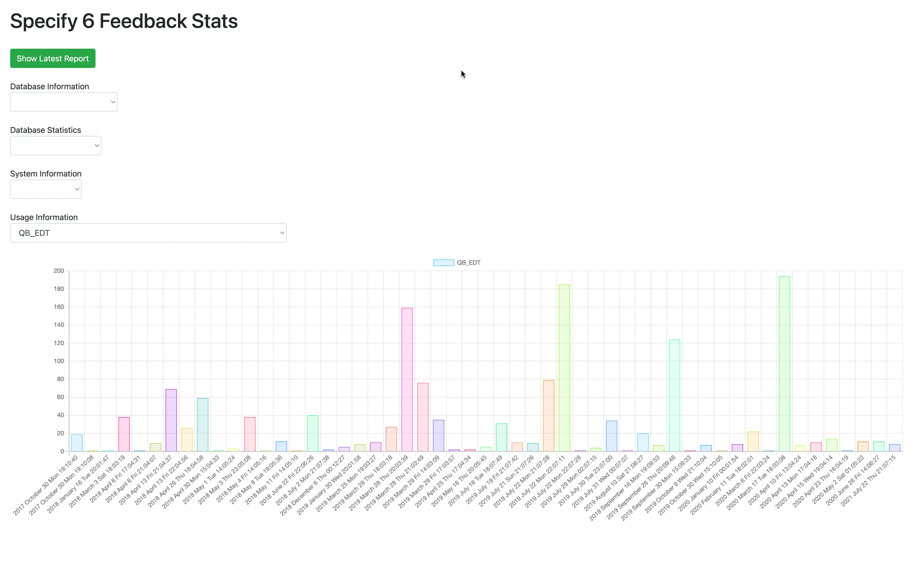
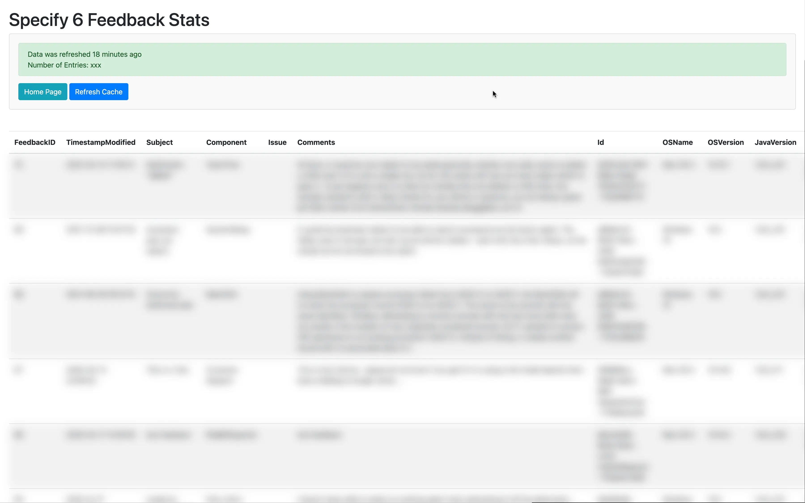
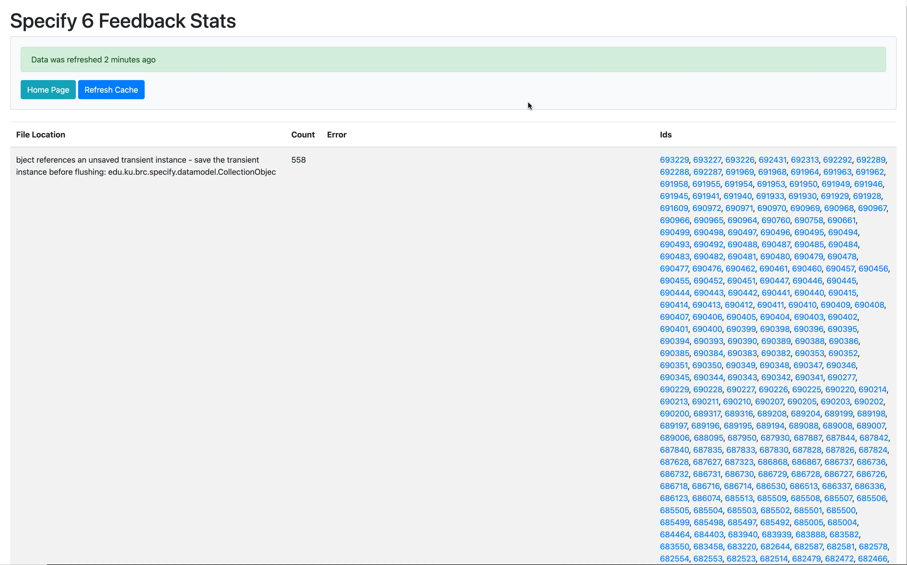

One of the first projects at my first job **during** college was modernizing a
legacy PHP codebase for an internal usage stats visualizer for
[Specify 6 application](http://github.com/specify/specify6/) - an open source
scientific collection management software.

The code already handled storing stats in the database, and rendering an
extremely bare interface for them. Unfortunately, copy paste was used generously
during development, documentation was never written and questionable
architectural decisions were made. As a result, before I could add any new
features, I had to spend several days studying the project, untangling the
spaghetti code and writing proper documentation along the way.

Main features

- You can see aggregate stats for all institutions, or drill down to usage
  patterns of users in a specific institution
- Specify 6 reports many metrics, including how often features are used and how
  big key database table there are. The stats visualizer allows to see user's
  database grows over time and how their usage patterns change. This also
  empowered our membership team to know when an institution decreased usage of
  Specify 6, and allowed them to follow up asking if assistance is needed.
- IP Addresses are resolved using [ip-api.com](https://ip-api.com) to find
  approximate locations of users
- User agents are parsed to find out browser and operating system versions
- By default data for the last 100 days is shown, but any range can be selected
- The computed analytics are cached, allowing for instant refresh. Cache is
  updated daily automatically, but there is also a button to update it manually
  at any point
- Nginx's NJS was used to create an authentication screen, barring access to
  anyone who is not part of the
  [Specify GitHub organization](https://github.com/specify/).
  [Source code for that](https://github.com/specify/nginx-with-github-auth)
- Specify 6 crash reports are reported to the stats visualizer, which can then
  show what errors occur most frequently, and on what platforms.

## Screenshots

## Online demo

Unfortunately, I am not able to provide a live demo URL as the tool is
accessible internally only, however, you are free to look at the
[source code](https://github.com/specify/sp6-stats)

## Technologies used

- PHP
- Chart.js
- MySQL
- Nginx and NJS (for authentication)
- [nginx-with-github-auth](https://github.com/specify/nginx-with-github-auth) -
  an Nginx module I wrote
- Bootstrap
- jQuery
- GitHub APIs

## Specify&nbsp;7 Usage Stats

In parallel with this project, I was tasked with writing a usage stats
visualizer for a separate application.
[See the results of that project.](/projects/usage-stats)

## Things learned

When I inherited the codebase, and saw in what state it was, at times I doubted
my ability to figure out what all of the code does. But, I had a vision in my
head for how much better the final result could be and used that to guide me
step by step.

This is where I first developed my approach for modernizing a legacy codebase:

1. Learn the main features of the app
2. Do a high level overview of the code
3. Reformat all files and apply static checker with auto fixes to make code more
   readable and automate some refactoring work
4. Figure out from which major components the app consists
5. Start learning each component one by one, and refactoring code as you go
   along
6. Take notes along the way, which can then be turned into documentation
