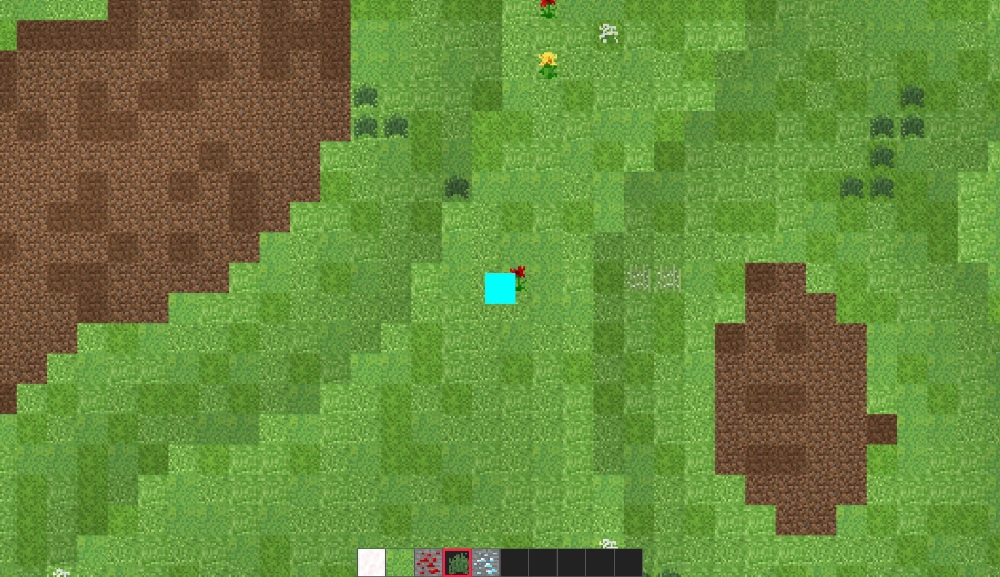
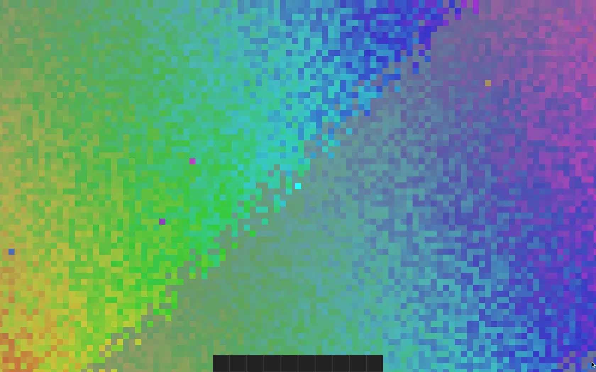
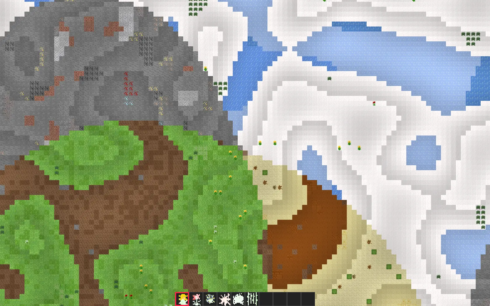

A Canvas-based walking & building simulator

Notable features:

- Procedurally generated map with biomes and patches of resources
- Inventory system with block placement support
- Save & Load capability
- The game utilizes OffscreenCanvas to cache resized textures and improve
  performance
- Special Development, Debugging, and Testing modes
- Autogenerated documentation
- Extensive description of the development and deployment process
- Keyboard navigation and screen reader support.

I worked on this project in a team of 5 as part of the EECS 448 class at the
University of Kansas. I took on the responsibilities of a team lead, which
involved keeping the team on track, prioritizing features, and working on the
most complex parts of the project. Later we presented the project in front of
100 peers.

Other team members lacked some experience with JavaScript, which made this
project harder.

## Screenshots

## Online demo

[Try out the live version](https://maxpatiiuk.github.io/eecs-448-pixelland/eecs-448-project-3/)

<mp-youtube caption="Video Demo" video="3guzbg383WA"></mp-youtube>

## Technologies used

Since there was a varying level of experience among the team members, we decided
not to use any fancy framework. Instead,
[I wrote a tiny MVC library](https://github.com/maxpatiiuk/eecs-448-pixelland/blob/main/eecs-448-project-3/lib/js/view.js)
modeled after Backbone.js's views.

Additionally, we used the OpenSimplex Noise generator to facilitate biome and
terrain generation.

## Documentation

There is
[autogenerated documentation](https://maxpatiiuk.github.io/eecs-448-pixelland/documentation/auto-docs-gen/)
based on JsDoc comments and
[extensive deployment instructions](https://github.com/maxpatiiuk/eecs-448-pixelland/tree/main/documentation).

## Things learned

This project was developed under unique circumstances in the sense that when we
begun it we didn't try to think too hard about what we were trying to achieve
and just went along for the ride to see what we get out of it.

While that's not the way I commonly approach projects, this gave us a sense of
freedom from externally imposed constraints or fear of missing out on
expectations.

Still, I am very happy with the result, especially the procedurally generated
map algorithm I developed.

One of the few goals we set at the beginning of this project was to not use any
external libraries beyond what native HTML/CSS/JavaScript offered. This gave us
an opportunity to learn about low level things like keyboard navigation and
canvas rendering. At the same time, beyond the learning opportunity, this was
not the most efficient way of doing things as we ended up reinventing solutions
to solved problems.
