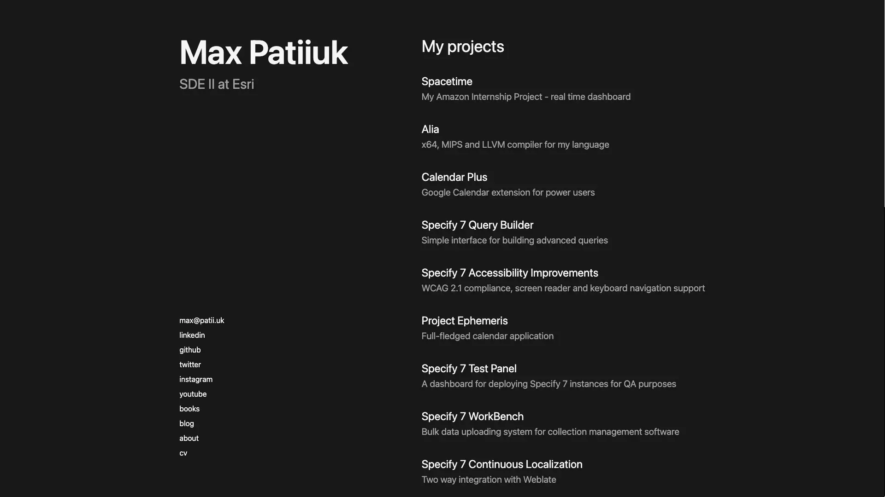
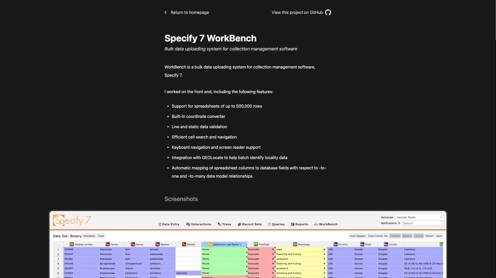

> This portfolio from 2021 has been superseded by a
> [new version in 2026](./portfolio-2026.md).

When it came to designing my portfolio, I wanted to make it represent my
aspirations for simplicity and purpose. That is why there are no cluttered
submenus, no useless footers, and no unnecessary information.

This site is primarily used as my portfolio, though it can also host random JS
projects ([check out my Tetris Game](https://bit.ly/-tetris-react)).

## Screenshots

## Technologies used

- JavaScript
- TypeScript
- React
- Next.js
- Tailwind.CSS

## Design inspirations

- [clementgrellier.fr](https://clementgrellier.fr/)
- [aakashns.com](https://aakashns.com/)
- [apple.com/newsroom](https://www.apple.com/newsroom)

## Things learned

I love how minimalistic the final design is. It's not as extreme as some of my
previous designs, but it strikes a perfect balance between looking formal, being
useful and being a pleasure to look at.

Still, after I finished the development, I learned the lesson that trying to
make a solution overly generic to meet a hypothetical future need is often a
waste of effort and results in added complication.

This is because the needs change often, and the complicated generic solution can
quickly become not generic enough, or the opposite - not needed at all as a
different feature is in need.

This leads me to today, where I design the systems to be the simplest they can
be to solve the current problem. Since the system is simple, it's small and
agile. There is less code, thus fewer places for bugs to be in. Similarly, since
it's small it's easier to extend or modify it once needs change.

One practical example of this is the fact that the portfolio was designed with
full localization support, yet I did not intend to translate it to any other
language. Localization middleware infected every component, and all for no good
reason. Thus, I did the refactoring where I got rid of localization support. If
the day would come when it would be needed, then I would create a new
localization solution as best fitting the requirements of the day. Until then, I
can enjoy some more simplicity.
