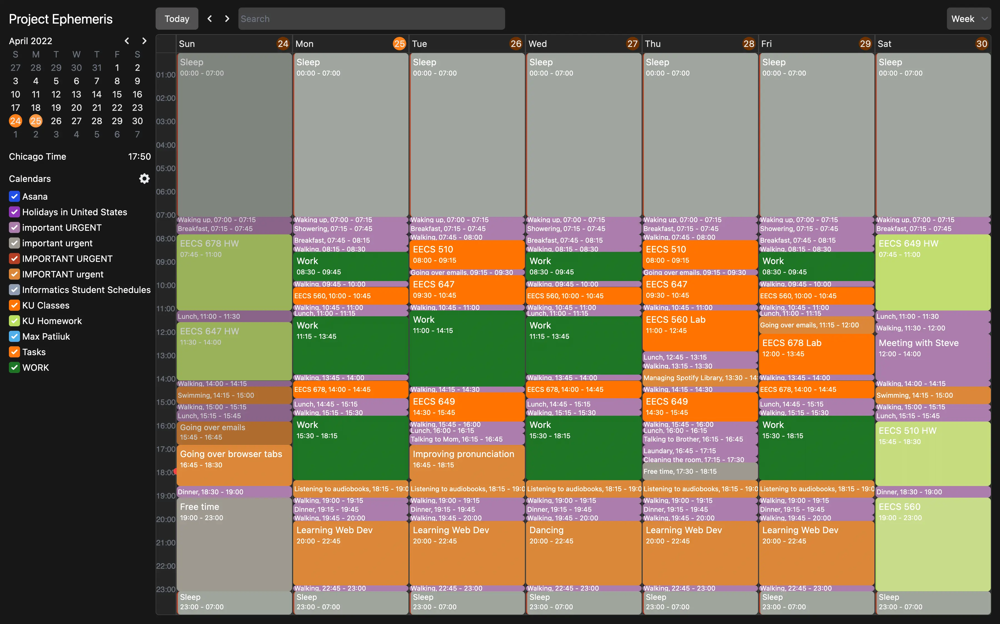
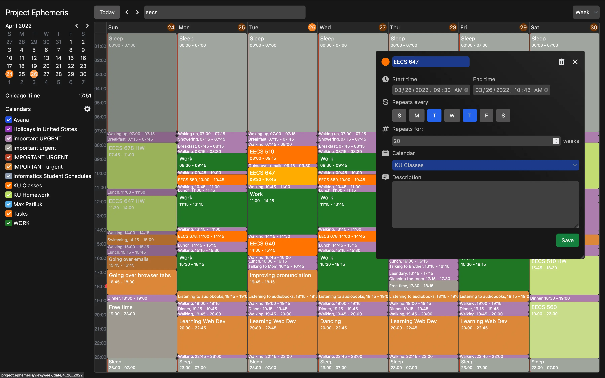
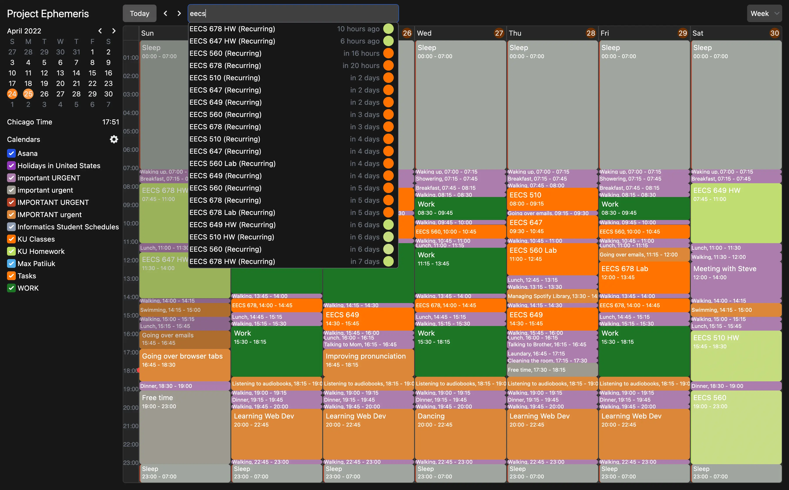
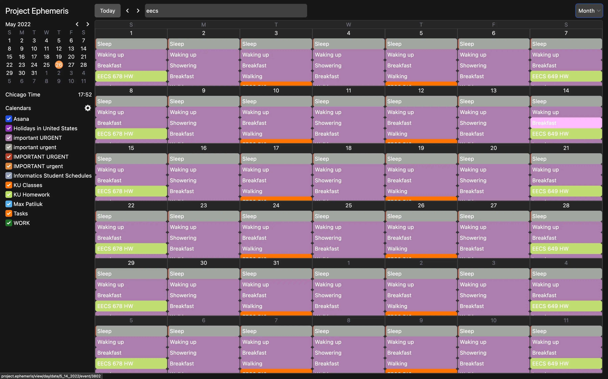
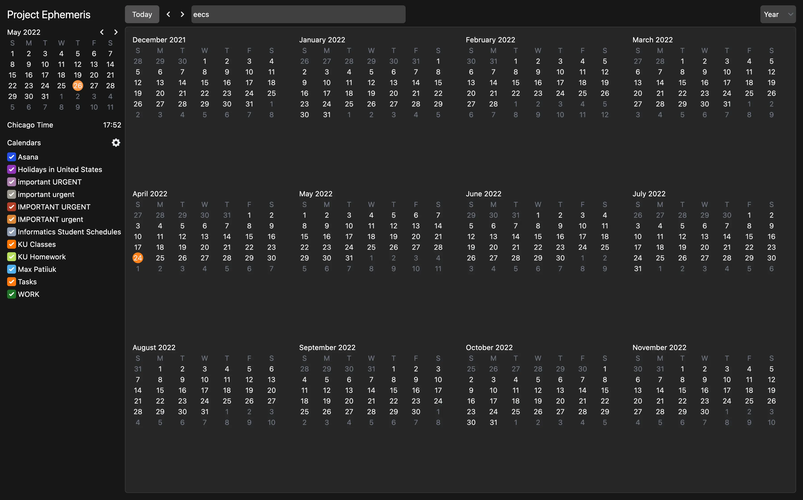
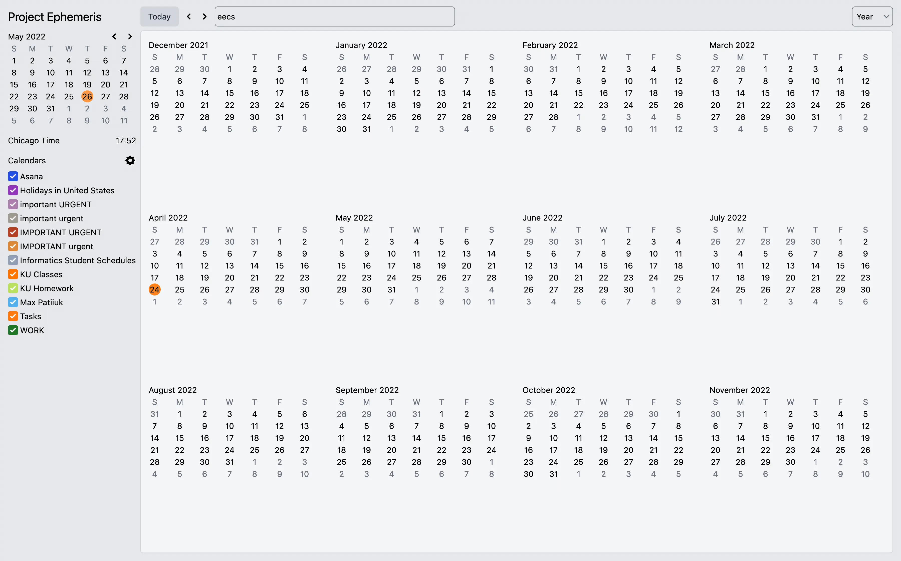
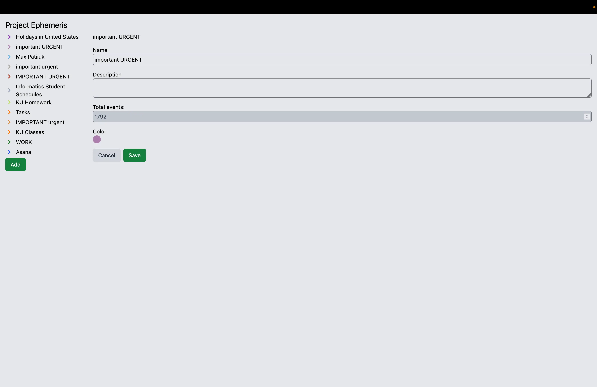

A full-fledged calendar application with support for multiple calendars,
repeated events, and best of all, dark mode. It has four view modes: year,
month, week, and day. Additionally, there is a good screen reader and keyboard
navigation support.

## Online demo

You can try out the live version at
[project-ephemeris.vercel.app](https://project-ephemeris.vercel.app).

<mp-youtube caption="Video overview" video="15tJGmPTuhQ"></mp-youtube>

## Screenshots

## Technologies used

- JavaScript
- TypeScript
- React
- Next.js
- Tailwind CSS
- MySQL

## Things learned

I am a heavy calendar user and consider myself experienced with it. Yet, it's
not until I tried to design a calendar that I started to realize the
complexities of a good calendar system.

There are big and glaring things like time zones and subtleties as inconspicuous
as an algorithm for most efficiently placing overlapping events on a grid.
