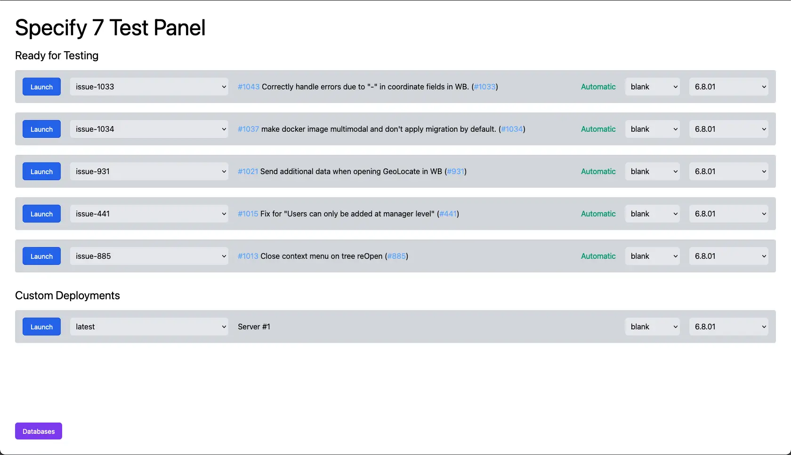
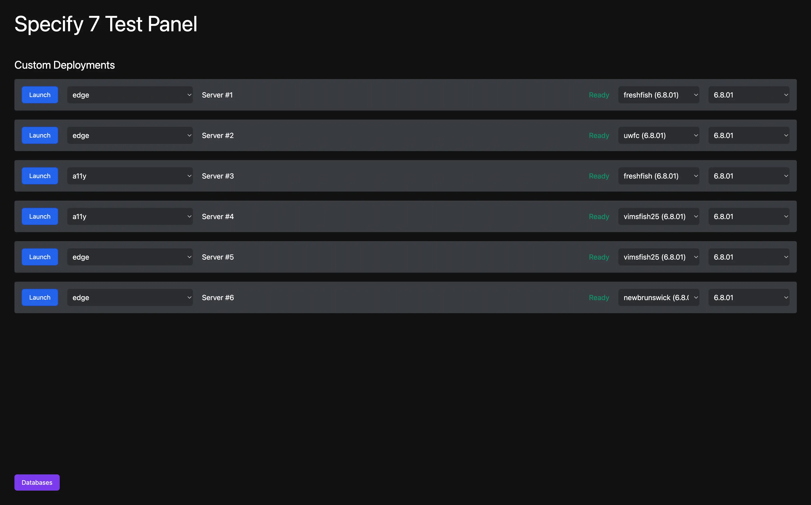
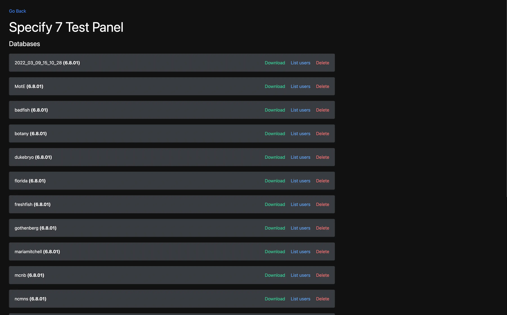
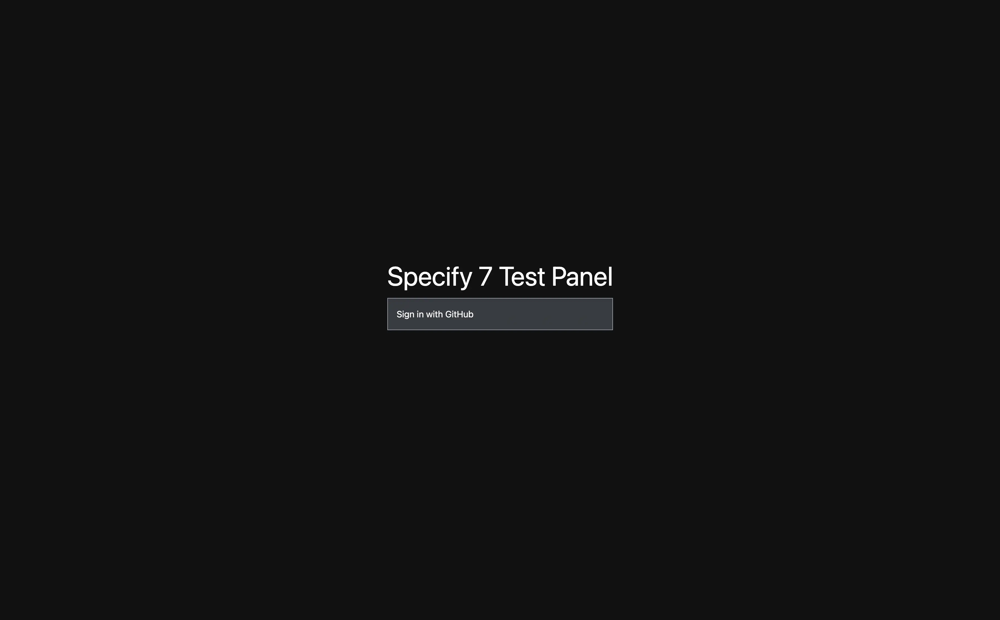

Test Panel is a Dashboard for configuring a cluster of docker containers of
[Specify&nbsp;7](https://github.com/specify/specify7), with an automatic
deployment feature.

The Test Panel is used to easily test different versions of the software and to
speed up the QA process for bug fixes by automatically deploying bug fixes that
are ready to be tested.

Notable features:

- Ability to reconfigure an existing deployment, or add a new one
- Automatic deployment of bug fixes that a ready to test
- Automatic cleanup of old deployments that are no longer used
- Beautiful UI
- GitHub OAuth authentication
- Regular polling of data to update the status of each deployment
- Ability to upload/download/drop a database

These features are described in more detail below:

## Automatic deployments

A GitHub Webhook has been configured for the Specify&nbsp;7 repository which
pings the test panel to check if some bug is ready to be tested.

A ready-to-be-tested bug is defined as a branch in the Specify&nbsp;7
repository, for which all automated tests have passed, and which has an
associated pull request that has been assigned for review to the QA team (or a
member of the team), and has not yet been reviewed. If a pull request has been
assigned for review both to a member of the development team and a member of the
QA team, the test panel deploys the branch only after the developer has approved
the pull request, so as not to waste the QA team's time testing code that may be
rejected.

If a maximum number of deployments has already been reached (defined in the
config file), the test panel tries to destroy old deployments that haven't been
accessed recently.

## Custom deployments

Besides the automated deployments, there is often a need to test a specific
branch (e.i. production) in a specific database to replicate a bug or get
everything ready for a release.

For these purposes, any deployment can have its configuration changed. Each
deployment has an associated DockerHub tag (created from a HEAD of a GitHub
branche), a database, and a data model version

## Database Management

Besides all deployments running in Docker, the test panel itself is Dockerized.
Docker composition comes with a MariaDB server to provide databases for
deployments.

The dashboard provides a list of databases, a list of users in each database
(needed for authentication into a Specify&nbsp;7 instance), and an ability to
upload a new database, download an existing one, or drop it.

## Online demo

For security purposes, the test panel is protected behind a GitHub OAuth
authentication, which only permits signing it with accounts that are members of
the ["specify" GitHub organization](https://github.com/specify/). Thus, even
though a live version is available at
[test.specifysystems.org](https://test.specifysystems.org/), the dashboard
itself is inaccessible. If you want to try out the test panel, I encourage you
to deploy it on your machine.

Exhaustive deployment instructions are documented in the
[README.md](https://github.com/specify/specify7-test-panel#readme)

It should be possible to reconfigure the dashboard to serve deployments of
software other than Specify&nbsp;7.

## Technologies used

- Docker
- JavaScript
- TypeScript
- React
- react-modal
- Next.js
- Tailwind.CSS
- MariaDB (and a mysql2 npm dependency)

## Things learned

While this project was nice in terms of usability and features (especially after
a few incremental updates), it did fall short in one important aspect.

A primary goal of the test panel is to emulate a production environment so that
testers can catch bugs before they get discovered by users.

However, as we eventually discovered, the test panel environment differed from
production in several important ways.

- The test panel allows only one password bases sign in. In production, single
  sign on and anonymous access can be configured. Since these are not available
  on the test panel, they were not tested, and bugs with these systems fell
  though the cracks
- Performance of the test panel does not match an average production system
- There were quite a few bugs specific to the test panel because of
  misconfiguration, latency issues, and other factors. If bugs occur only in a
  test panel, but not in production, it leads to loss of faith in the usefulness
  of the test panel.

As it often happens, once the test panel came into heavy usage, the issues
mentioned above were discovered. Fixing them is an ongoing incremental process,
but it showed me the importance of the tool being really good at the core thing
it is indented to do.
