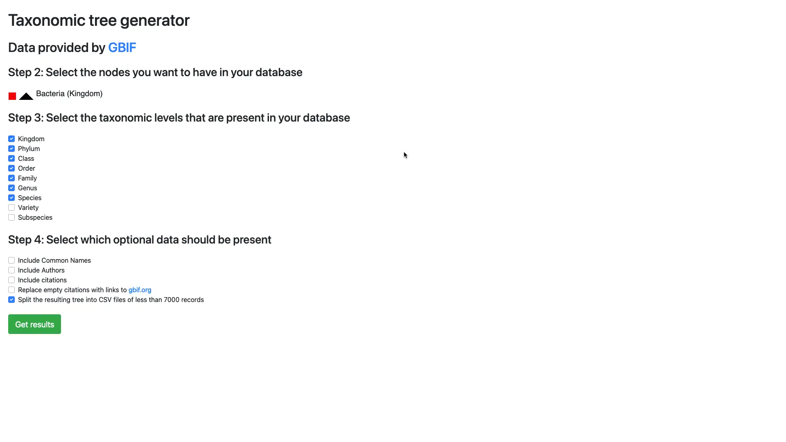
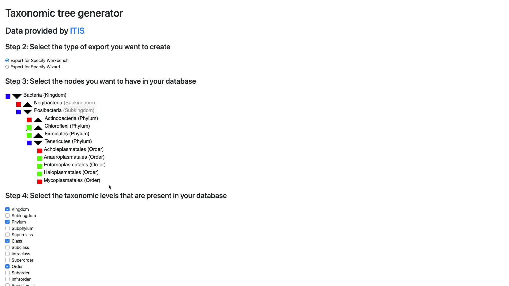

There are various taxon data authorities that allow downloading their data
either one species at a time, or as a huge SQL dump file, which is not practical
for some use cases.

I developed a simple tool that allows easy download of a subset of data from
GBIF, Catalogue of Life or ITIS as a CSV file.

In addition to being able to specify which Phylums, Genera and Species should be
included in the exported file, you can choose among various Infra- and Sub-
specific ranks or to include optional metadata to better customize the result to
your needs

## Online demo

You can try out the live version at
[taxon.specifysoftware.org](https://taxon.specifysoftware.org/itis/).

<mp-youtube caption="A demo of Taxa Tree Generator" video="zLrSncbOF8Y"></mp-youtube>

## Screenshots

## Technologies used

- PHP 7.4
- Nginx
- Docker
- MySQL
- Bootstrap
- JavaScript

## Things learned

Long gone are the days when crunching through the dataset of species known to
humanity is a task suitable for supercomputers only. Still, their current
implementation of the tool is not the most efficient possible. In fairness, it
was designed with features in mind first and foremost, still, performance
problems are plaguing the production use of the tool.

## Impact

Update from 2025: it's been 5 years, and this project is still in use to import
millions of taxa records.
