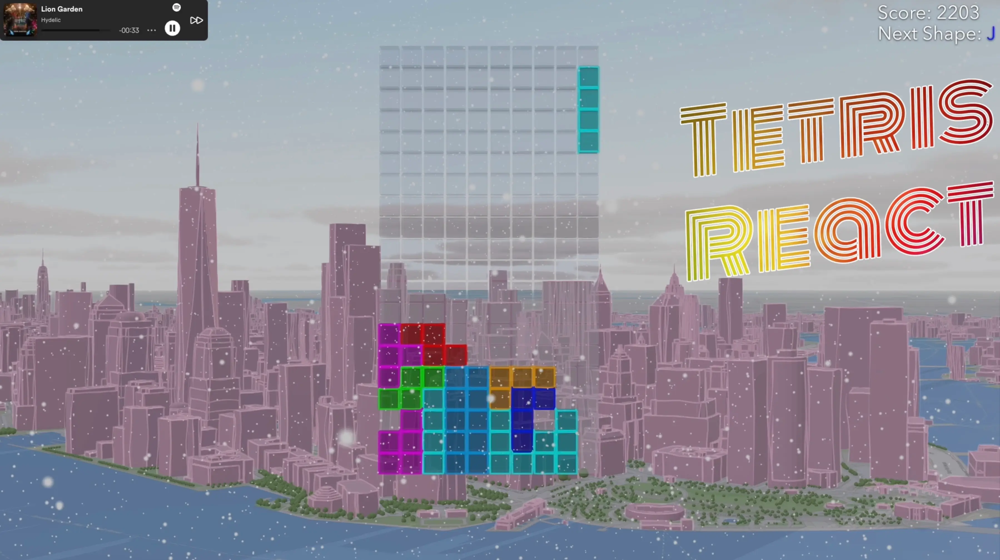
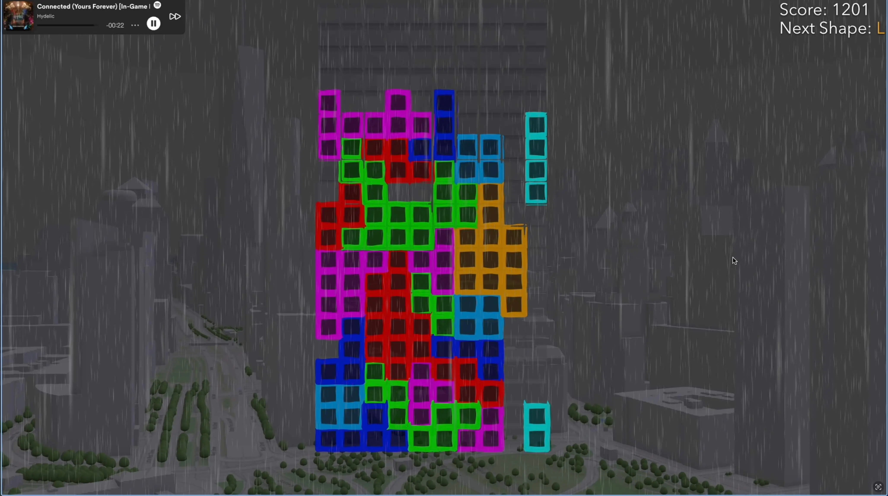
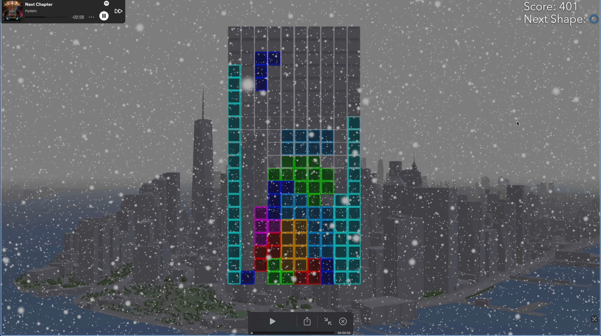
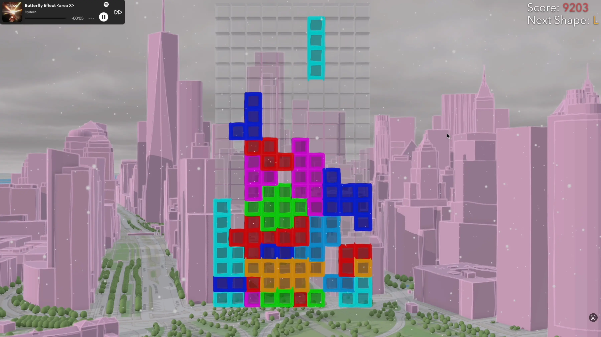
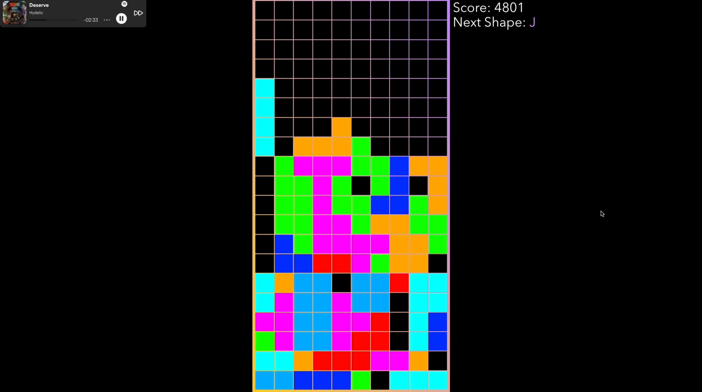

> This project was presented during SpeedGeeking session at Esri DevSummit 2024.
>
> - [Slides](https://maxpatiiuk.github.io/tetris-react)
> - [Session Details](https://github.com/maxpatiiuk/esri-dev-summit-presentations/tree/main/202r/tetris-react)

Tetris was one game I could always easily lose myself in. I decided to make
learning ArcGIS Maps SDK for JavaScript more fun by making a game using it.

<mp-youtube video="LlDgH-NZ3KE" caption="Tetris React - Gameplay"></mp-youtube>

## Play online

[Play online for free](https://maxpatiiuk.github.io/tetris-react/)

## Screenshots

By the way, can you beat my high score?

## Technologies used

- ArcGIS Maps SDK for JavaScript
- Tailwind.css
- TypeScript
- React
- JavaScript
- Next.js
- Ramda.js (used initially, but removed in later version)

The result is an oddly addictive and fun browser game. Thanks to pause, save and
load mechanics you can play it briefly between the meetings or try to beat your
friend's best score by discovering one of the secret cheat-codes hidden in the
game.

Camera moves around downtown New York, or hovers of the waterfront part, while
building colors dance and weather effects like fog and rain impede visuals - all
for the sake of creating an engaging atmosphere.

The code architecture is quite scalable thanks to the separation between view,
model and controller - to add a new level, just create a new view, without the
need for any changes to game's state or reducer logic.

> Note, this game was originally written by me in 2021 when I was learning
> Next.js and Ramda.js. Back then, it only included the "Grid World" level.

## Things learned

- How to use the SceneView in ArcGIS Maps SDK for JavaScript, in combination
  with weather effects, meshes, textures, animations and camera movement
- Tetris is addictive.
