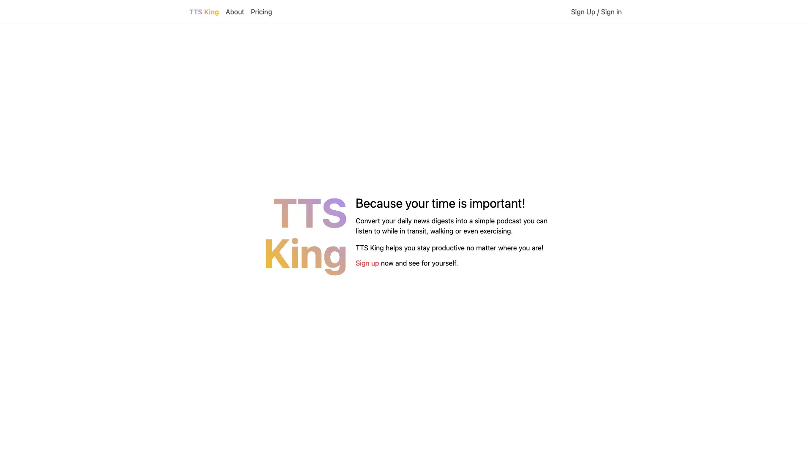
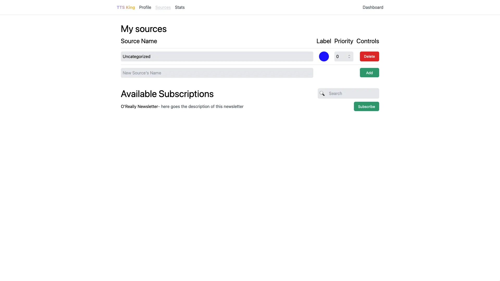
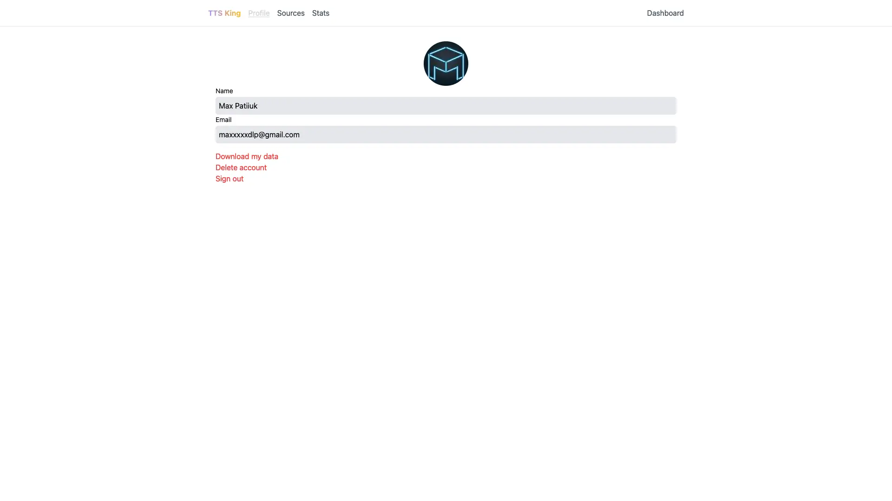

Convert your daily news digests into a simple podcast you can listen to while in
transit, walking or even exercising. TTS King helps you stay productive no
matter where you are!

The idea behind this website was to automatically convert your newsletter emails
and favorite news articles to audio files using Text-To-Speech technologies and
then to download these audio files to your phone for offline playback.

The site is still under development and has a lot of missing features. It's been
in development for quite a while now because when I started, I decided to learn
a completely new tech stack to freshen up my skills (since PHP, Bootstrap and
MySQL no longer are a hot topic of discussion).

## Technologies used

- Next.js
- Firebase Authentication & Realtime Database
- Tailwind.css
- TypeScript
- React
- JavaScript

## Screenshots

## Things learned

It's okay to not finish a project. You can get value out of it even if it's not
finished. I learned Next.js, Tailwind.CSS and other important tools thanks to
this project. Thus, despite the project being left unfinished, I feel like it's
been a big net positive due to experience gained.

Few years later, I pivoted the goal, and launched a
[Text Hoarder](/projects/text-hoarder) browser extension.
