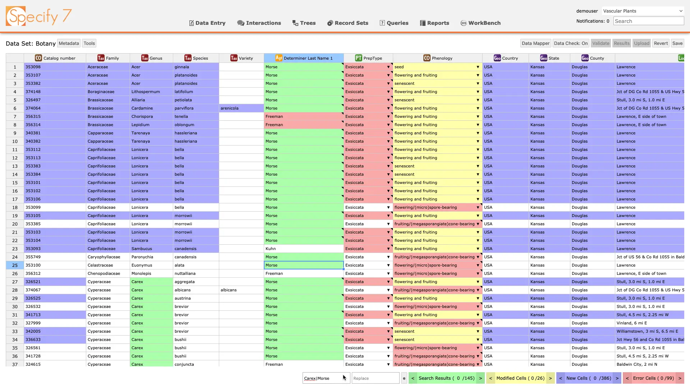
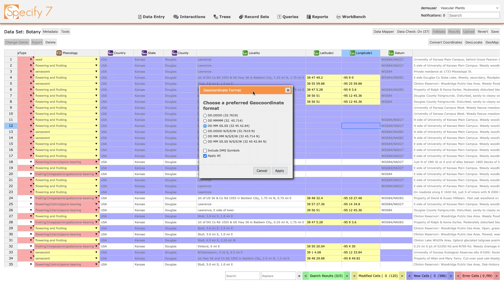
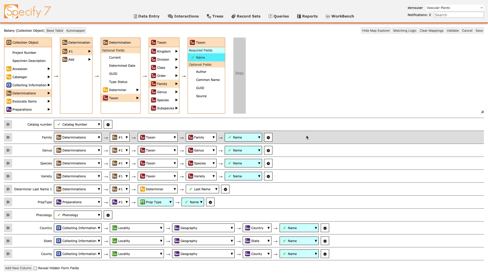
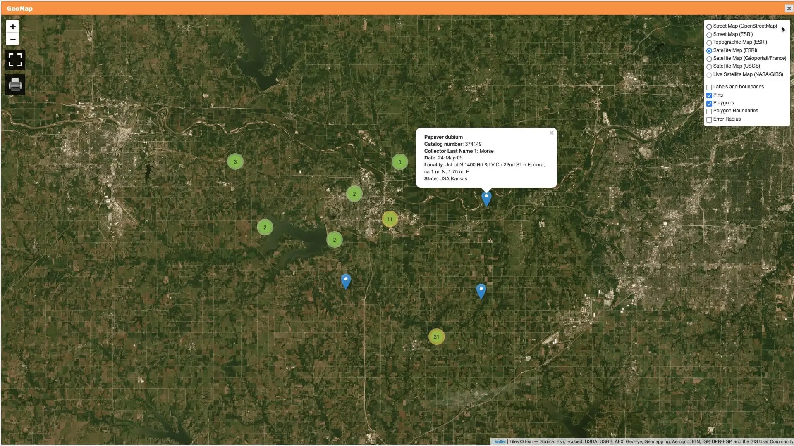

WorkBench is a bulk data uploading system for collection management software,
Specify&nbsp;7.

I worked on the front end, including the following features:

- Support for spreadsheets of up to 500,000 rows
- Built-in coordinate converter
- Live and static data validation
- Efficient cell search and navigation
- Keyboard navigation and screen reader support
- Integration with GEOLocate to help batch identify locality data
- Automatic mapping of spreadsheet columns to database fields with respect to
  -to-one and -to-many data model relationships.

## Screenshots

<mp-youtube caption="Video review" video="lg9ybKMPQXI">

An overview of a beta version of the WorkBench by one of our team members:

</mp-youtube>

<mp-youtube caption="Specify WorkBench demo for SpeciForum 2021" video="83GXeGeihqE"></mp-youtube>

## Online demo

You can try out the live version at
[sp7demofish.specifycloud.org](https://sp7demofish.specifycloud.org/). The
username and password are <mark>sp7demofish</mark>. When prompted to select a
collection, choose any option. See usage instructions in the video above.

## Technologies used

- JavaScript
- TypeScript
- React
- Docker
- Leaflet (library for interactive maps)

<mp-youtube caption="Overview of the mapping capabilities" video="ELc4srgjvkU"></mp-youtube>
<mp-youtube caption="Overview of the mapping capabilities (in Russian)" video="fw_Ps4nF5FY" start="386"></mp-youtube>

## Things learned

During the development of the WorkBench, most of the testing was done with data
sets that were convenient for developers - 20-50 rows with 10-20 columns. It's
only in the last few months before release that testing with a real world sizes
data sets had begun. This quickly showed us that the tool had obvious
performance issues and required us to scramble to fix it and to delay the
release.

The lesson I learned from this is that testing should be done through the
development process to make sure the tool is on track to meet the goals, and the
testing performed should resemble real world use cases.
